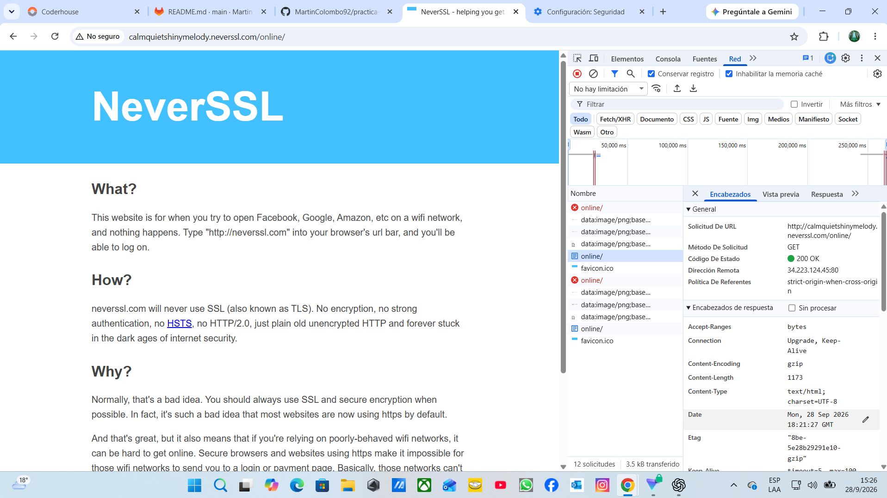

# Informe de Auditoría de Red Wi-Fi Insegura

## Introducción

En esta práctica analicé el comportamiento de una página que utiliza HTTP para comprender los riesgos de navegar en una red Wi-Fi pública.

Para realizar el análisis utilicé las herramientas de desarrollador de Google Chrome, específicamente la pestaña Network, donde es posible observar las solicitudes realizadas por el navegador y parte de la información que viaja durante la comunicación.

El sitio utilizado para la práctica fue:

http://neverssl.com

Durante la navegación, NeverSSL utilizó el host:

`calmquietshinymelody.neverssl.com`

---

## Sitio analizado

Al analizar la solicitud principal se observaron los siguientes datos:

- URL: `http://calmquietshinymelody.neverssl.com/online/`
- Método HTTP: `GET`
- Código de respuesta: `200 OK`
- Dirección remota: `34.223.124.45:80`
- Protocolo utilizado: HTTP
- Puerto utilizado: 80

El puerto 80 y el uso de `http://` indican que la comunicación no está protegida mediante HTTPS.

---

## Evidencia observada

En la captura de las herramientas de desarrollador se pueden observar distintos datos de la solicitud HTTP.

Entre ellos aparecen:

- Host
- URL solicitada
- Método GET
- User-Agent
- Accept
- Accept-Language
- Connection
- Otros encabezados enviados por el navegador

---

## ¿Qué protocolo utiliza el sitio?

El sitio utiliza **HTTP**.

HTTP permite transmitir información entre el navegador y el servidor, pero por sí mismo no incorpora cifrado.

Esto significa que los datos pueden circular de forma legible por la red, a diferencia de HTTPS, que utiliza TLS para cifrar la comunicación.

---

## ¿Qué información puede observarse durante la solicitud?

Durante el análisis pude observar información como:

- El dominio o Host solicitado.
- La URL visitada.
- El método HTTP utilizado (`GET`).
- El navegador y sistema utilizado mediante el `User-Agent`.
- Distintos headers enviados durante la solicitud.

Esto demuestra que una comunicación HTTP puede revelar información sobre la navegación del usuario.

---

## Riesgos encontrados

Utilizar HTTP desde una red Wi-Fi pública puede representar un riesgo porque la comunicación no está cifrada.

Un atacante ubicado en la misma red podría intentar capturar tráfico utilizando herramientas de análisis de paquetes.

Dependiendo de la página y de los datos transmitidos, podría llegar a observar:

- Sitios visitados.
- URLs.
- Headers HTTP.
- Datos enviados mediante formularios inseguros.
- Información de sesión si una aplicación estuviera mal configurada.

Por este motivo no debería enviarse información sensible mediante páginas que utilicen únicamente HTTP.

---

## ¿Cómo ayuda una VPN?

Una VPN crea un **túnel cifrado** entre mi dispositivo y el servidor de la VPN.

El tráfico se encapsula dentro de ese túnel y viaja cifrado mientras atraviesa la red Wi-Fi local.

Esto significa que una persona conectada a la misma Wi-Fi tendría muchas más dificultades para observar directamente el contenido de mis comunicaciones.

La VPN ofrece:

- Cifrado del tráfico entre el dispositivo y el servidor VPN.
- Encapsulamiento de los paquetes dentro de un túnel seguro.
- Mayor privacidad frente a otros usuarios de la red local.
- Protección adicional al utilizar redes Wi-Fi públicas.

Sin embargo, una VPN no convierte una página HTTP en HTTPS. Una vez que el tráfico sale del servidor VPN hacia un sitio HTTP, esa parte de la comunicación continúa sin el cifrado propio de HTTPS.

Por eso lo más seguro es combinar una VPN con sitios que utilicen HTTPS.

---

## Mis 3 Reglas de Oro para usar Wi-Fi públicas

1. **Usar HTTPS siempre que sea posible.**  
   Antes de ingresar contraseñas o información personal, comprobar que el sitio utilice una conexión HTTPS.

2. **Utilizar una VPN en redes públicas.**  
   La VPN crea un túnel cifrado que ayuda a proteger el tráfico frente a otros usuarios conectados a la misma red.

3. **Evitar operaciones sensibles en redes desconocidas.**  
   No realizar operaciones bancarias, compras o ingresar información confidencial si no es necesario. También verificar siempre que la red Wi-Fi sea realmente la oficial del lugar.

---

## Conclusión

Esta práctica me permitió comprobar la diferencia entre navegar mediante HTTP y utilizar mecanismos de protección como HTTPS y una VPN.

En la captura de NeverSSL fue posible observar información como el host, la URL, el método GET, la dirección remota y distintos headers.

En una red Wi-Fi pública, este tipo de información puede quedar expuesta si la comunicación no está cifrada. Utilizar HTTPS, una VPN y verificar la red antes de conectarse son medidas básicas para reducir estos riesgos.
